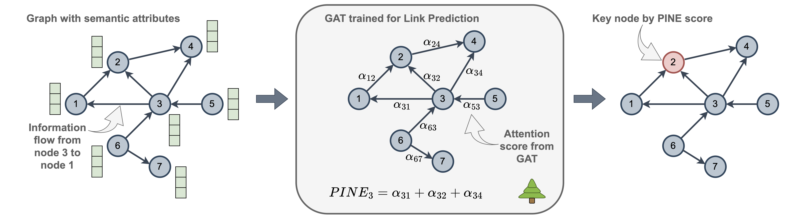
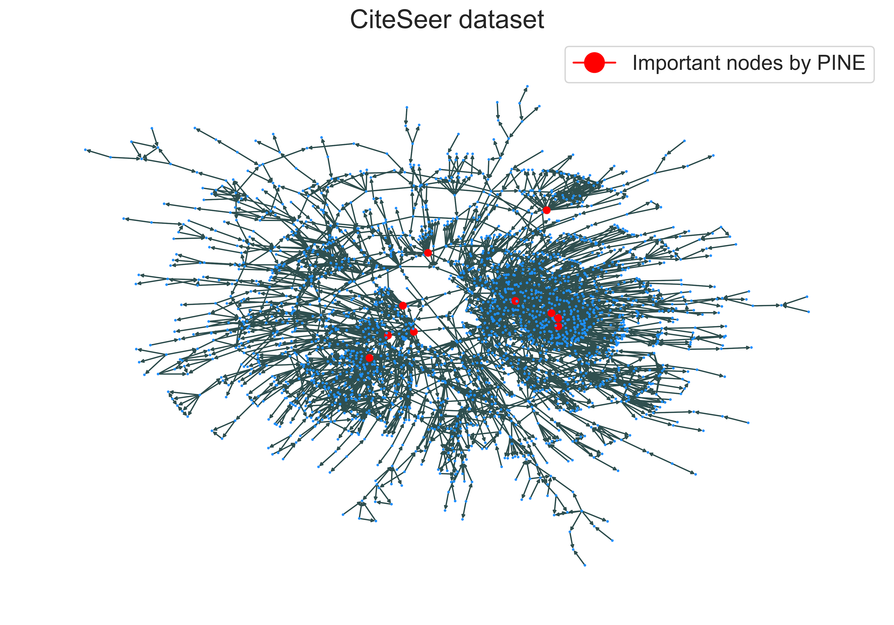

# PINE🌲: Pipeline for Important Node Exploration in Attributed Networks

PINE is an unsupervised approach for identifying important nodes in attributed networks. Importance of nodes is considered within an Influence Maximization (IM) paradigm. In the context of IM, the nodes are vital if they cause a great information spread in the network when a knowledge dissemination starts from them. PINE allows to effectively account for node features to discover crucial nodes from topology and attribute perspectives. PINE framework includes training of Graph Attention Network (GAT) to solve Link Prediction task for a subsequent use of attention distribution in node importance estimation. A presence of learning component is a key difference from the traditional centrlaity measures, like Degree Centrality or PageRank. 



In summary, the result of PINE work is an identified set of important nodes in view of graph structure and node attributes:



# 🚀 Launch PINE


### Step 1. Set environment
To start, create conda environment with the name 'pine_env' with proper dependencies by running: 
```
conda env create --file=environment.yml
```
Then, activate it:
```
conda activate pine_env
```


### Step 2. Get data

We provide the studied datasets in [https://drive.google.com/drive/folders/10gtjmNtiOMKBSQ906t3lUIx4OXF7mQkD?usp=share_link](https://drive.google.com/drive/folders/10gtjmNtiOMKBSQ906t3lUIx4OXF7mQkD?usp=share_link). Seven attributed homogeneous networks are under consideration: Cora, CiteSeer, PubMed, Wiki-CS, HEP-TH, ogbn-Arxiv, and DBLP.
To download them into folder `data`, run:
```
bash bin/get_data.sh
```
ogbn-Arxiv dataset is available from [Open Graph Benchmark](https://ogb.stanford.edu/docs/nodeprop/). 

The datasets, like Cora, CiteSeer, PubMed, Wiki-CS, and ogbn-Arxiv come with already prepared embeddings for text attributes in nodes. For the DBLP dataset, we use graph with node embeddings prepared in [TAG-benchmark](https://github.com/sktsherlock/TAG-Benchmark) (roberta_base_512_cls model). For HEP-TH dataset, we utilize [PhysBERT](https://huggingface.co/thellert/physbert_cased) model to infer embeddings (check [python script](src/data_preparation/get_embeds_hepth.py) for that, transformers library is needed). 


### Step 3. Run methods
Here, we compare PINE with a set of traditional centrality measures. 

**Problem setup**. A goal of each method is to associate every node in a graph with an importance score. The larger assigned score the more important the node is considered to be in the network. 

**Evaluation of results**. 
To compare methods' performance, we adopt a simulation-based procedure. Each method associates importance scores with nodes. Then, top-K nodes are taken as seed nodes for the start of information diffusion process. At the end, an influence spread over the network is evaluated. We assume that the method is better than others if it identifies nodes, which lead to the greatest spread of information. 

**Propagation models**.
As we consider attributed networks, it is important to simulate information diffusion taking into account node attributes. To do this, each edge of the graph is associated with topology and attribute weights. Then, these weights are used in such propagation models as **Linear Threshold (LT+)** and **Independent Cascade (IC+)**. Plus sign in their names indicates their attribute-awareness. In addition, we utilize a classical **SIR** propagation model, but it relies only on the graph structure. The implementations of propagation models are given in a folder `src/simulation`: [**LT+**](src/simulation/LT_plus.py), [**IC+**](src/simulation/IC_plus.py), and [**SIR**](src/simulation/SIR.py).

**Launch script**

```
python src/run_methods.py \
--dataset_names 'cora' 'citeseer' 'pubmed' 'wiki-cs' 'hepth' 'ogbn-arxiv' 'dblp' \
--measure_names 'pine' 'degree' 'out-degree' 'weighted' 'relative' 'pagerank' 'voterank' 'katz' 'closeness' 'betweenness' 'entropy_dir' \
--propagation_model_names 'LT+' 'IC+' 'SIR' \
--res_folder './simulation_results' \
--device 'cuda:0' \
--node_ratio 0.1 \
--num_runs 1000
```

* `dataset_names` is names of networks, on which different measures are compared.
* `measure_names` is names of measures for node importance estimation.
* `propagation_model_names` pointa out which propagation models to use for a simulation of information dissemination in a network.
* `device` is used for PINE training. Other graph measures are calculated on cpu by default.
* `node_ratio` is a part of the nodes from which information dissemination process starts. 0.1 means that 10\% of nodes with the greatest importance scores are initialized as active.
* `num_runs` is a number of Monte-Carlo simulation runs.
* `res_folder` will contain the results that include optimized hyperparametrs of GAT, which is trained within PINE, and csv files with influence spread values for the selected measures under the specified propagation models.


# Case of heterogeneous network
We explore a heterogeneous network called FB15K, which is a subset from a FreeBase. The data preprocessing step follows the precedure outlined in [repo](https://github.com/yankai-chen/EASING) on the basis of the [work](https://arxiv.org/pdf/2503.20697). 

To download a heterogeneous network FB15K into a folder `heterogeneous_data`, run:
```
bash bin/get_heterogeneous_data.sh
```

The structure of data files in the folder `FB15K` is the following:
* `fb15k_rel.pk` - file with graph data and structural features of nodes
* `fb_lang.pk` - file with semantic features of nodes
* `idx_1000` - folder that contains data splits with node IDs and their labels (ground truth markup of node importance scores)

In a heterogeneous case, PINE considers subgraphs with particular edge types separately. For each subgraph that includes edges of one type, PINE produces importance scores for nodes that are part of this subgraph. To run heterogeneous PINE:

```
python src/heterogeneous_pine_scoring.py \
--dataset_name 'FB15K' \
--data_path './heterogeneous_data' \
--exp_name 'base' \
--graph_data 'fb15k_rel.pk' \
--semantic_data 'fb_lang.pk' \
--split_data 'idx_1000' \
--num_split_idx 1000 \
--result_folder './heterogeneous_results' \
--device 'cuda:0' \
--num_runs 5 \
```

* `num_runs` - the number of PINE laucnhes on each subgraph

After running the script, `result_folder` will contain folder `{dataset_name}_pine_importances` with json files that store PINE scores for nodes from subgraphs of different edge types. Also, `{dataset_name}_res_{exp_name}.csv` file will be saved in `result_folder`, which includes information on optimized hyperparameters (for GAT within PINE), metrics for solving Link Prediction task, and supervised metrics for node importance estimation problem. Supervised metrics are also provided for out-degree measure to compare with PINE results. 

After scoring subgraphs of different edge type, one needs to aggregate results to get final importance scores for nodes. The validation set is used to select the relevant edge types to target task. Run the following script:

```
python src/heterogeneous_pine_aggregation.py \
--dataset_name 'FB15K' \
--data_path './heterogeneous_data' \
--exp_name 'base' \
--graph_data 'fb15k_rel.pk' \
--semantic_data 'fb_lang.pk' \
--split_data 'idx_1000' \
--num_split_idx 1000 \
--result_folder './heterogeneous_results' \
--device 'cuda:0' \
--pine_edge_types_folder 'FB15K_pine_importances_base' \
--pine_edge_types_metrics 'FB15K_res_base.csv' \
--final_res_name 'FB15K_final_supervised_res.json' \
--pine_thr 0 \
--train_num 8 \
```

* `pine_edge_types_folder` - folder with PINE scores for subgraphs of different edge types (result of `heterogeneous_pine_scoring.py` running)
* `pine_edge_types_metrics` - file with metrics for different edge types (result of `heterogeneous_pine_scoring.py` running)
* `final_res_name` - name of json file with final supervised metrics
* `pine_thr` - threshold on Spearman correlation of PINE scores for one edge type and global ground truth scores. This parameter is needed to select edge types for overall PINE score calcultation
* `train_num` - number of folds to include into train set for supervised evaluation (like it is done in [repo](https://github.com/yankai-chen/EASING))


To run full pipeline without division on scoring-aggregation steps:
```
bash bin/pine_heterogeneous_pipeline.sh
```

# Patent data

We provide the studied datasets on patent networks in https://drive.google.com/drive/folders/1ZYhW_FixUBKTDjegfbZKg62VrEAkt0gR?usp=sharing. The folder name, e.g. photolithography_simulation, corresponds to the technological domain, for which patents are collected. Inside each folder, there is a `patents.csv` file with information on patents and their citation relations. The columns in dataframe have the meanings:
* `title` - title of the patent
* `id` - the patent number
* `abstract` - abstract of the patent
* `claims` - the patent claims
* `citations` - ids and titles of patents that are cited by the considered patent
* `cited_by` - ids and titles of patents that cite the considered patent
* `classification_codes` - patent CPC codes 
* `date` - the patent published date
* `id_family` - a group of ids related to the considered patent. A patent can have multiple assigned ids due to being in different statuses or being registered in several jurisdictions
* `cit` - the ids of patents that are present in the dataframe and are cited by the considered patent
* `cit_by` - the ids of patents that are present in the dataframe and cite the considered patent
* `score` - a relevance score of a patent toward the technological domain under consideration. The relevance score is estimated as a cosine similarity beween embeddings of patent title and a domain-related keyword, e.g. "photolithography simulation". Embeddings are obtained with a language model https://huggingface.co/AI-Growth-Lab/PatentSBERTa.

To download all datasets into folder `data`, run:
```
bash bin/get_patent_data.sh
```

The file with partial expert markup is given via [link](https://docs.google.com/document/d/1O0ay6SVFiFTjfwXFgUMyjs0Rf9oURGdW/edit?rtpof=true).


